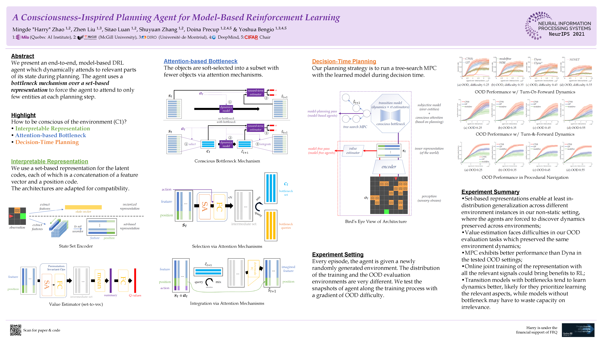

### [A Consciousness-Inspired Planning Agent for Model-Based Reinforcement Learning](http://mingde.world/publications/a-step-towards-conscious-planning)
_By Mingde "Harry" Zhao, Zhen Liu, Sitao Luan, Shuyuan Zhang, Doina Precup and Yoshua Bengio_



#### ([BLOGPOST](http://mingde.world/publications/a-step-towards-conscious-planning))

#### **Install Dependencies**
```
pip install -r requirements.txt
```

#### **Reproducing Results**

CP
```
python run_distshift_randomized_mp.py --method DQN_CP --num_explorers 8 --ignore_model 0 --disable_bottleneck 0 --size_bottleneck 8
```

UP
```
python run_distshift_randomized_mp.py --method DQN_CP --num_explorers 8 --ignore_model 0 --disable_bottleneck 1
```

WM
```
python run_distshift_randomized_mp.py --method DQN_WM --num_explorers 8 --ignore_model 0 --disable_bottleneck 0 --size_bottleneck 8 --period_warmup 1000000
```

Dyna
```
python run_distshift_randomized_mp.py --prioritized_replay 0 --method DQN_Dyna --num_explorers 8 --ignore_model 0 --disable_bottleneck 0 --size_bottleneck 8 --learn_dyna_model 1
```
*Special thanks to my Mila colleague and friend Safa Alver [@alversafa](https://github.com/alversafa) for pointing out that Dyna shouldn't prioritize on the errors generated by potentially inaccurate imagined transitions, as well as the runtime bugs surrounding this matter!*

Dyna*
```
python run_distshift_randomized_mp.py --method DQN_Dyna --num_explorers 8 --ignore_model 0 --disable_bottleneck 0 --size_bottleneck 8 --learn_dyna_model 0
```

NOSET
```
python run_distshift_randomized_mp.py --method DQN_NOSET --num_explorers 8 --ignore_model 0 --layers_model 2 --len_hidden 256
```

#### **Changing Settings**

Read run_distshift_randomized_mp.py!
